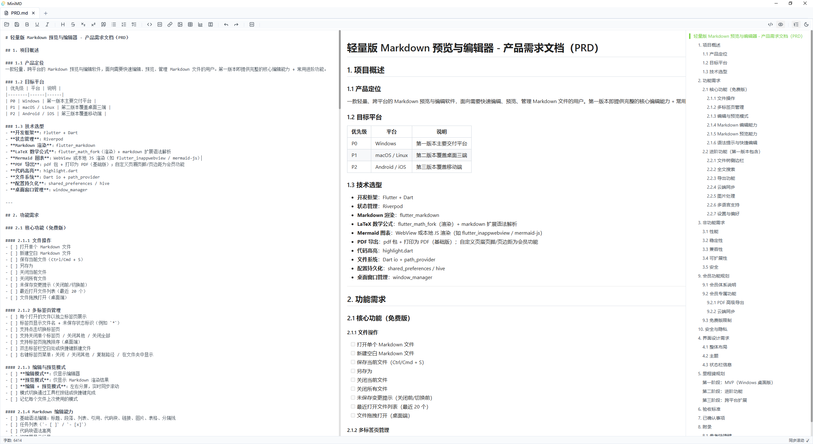

<div align="center">

# MiniMD

**轻量、跨平台的 Markdown 编辑与预览工具 / A lightweight, cross-platform Markdown editor**



[](LICENSE)
[](#-平台支持-platform-support)
[](https://tauri.app/)
[](https://react.dev/)
[](https://www.typescriptlang.org/)
[](https://www.rust-lang.org/)

[English](#-english) · [中文](#-中文) · [截图](#-截图-screenshots) · [快速开始](#-快速开始-quick-start) · [路线图](#-路线图-roadmap)

</div>

---

## 🇨🇳 中文

### ✨ 简介

**MiniMD** 是一款基于 **Tauri 2 + React 19 + TypeScript** 构建的桌面 Markdown 编辑器，主打「轻量、即时预览、可双击打开」。第一版本（v0.1.0）面向 Windows 平台交付，后续将逐步覆盖 macOS、Linux 与移动端。

### 🎯 核心特性

- 📝 **完整 Markdown 编辑能力** — 标题、列表、引用、表格、代码块、任务列表、GFM 等
- 👀 **三种视图模式** — 编辑模式 / 预览模式 / 左右分屏（实时同步滚动）
- 🧮 **LaTeX 数学公式** — 行内 `$...$` 与块级 `$$...$$`，由 KaTeX 渲染
- 📊 **Mermaid 图表** — 流程图、时序图、类图、甘特图等
- 🗂️ **多标签页管理** — 同时打开多个文件，未保存状态标识（`*`），一键新建 / 关闭
- 🌓 **明亮 / 暗黑主题** — 一键切换，跟随你的工作节奏
- 📁 **原生文件集成** — 注册 `.md` / `.markdown` / `.mdx` 文件关联，**双击本地 Markdown 文件直接打开**（macOS 首次需右键「打开」）
- 🔁 **单实例运行** — 已运行时再次双击文件，会激活已有窗口并在新标签页中打开
- ⌨️ **常用快捷键** — `Ctrl+N` 新建 / `Ctrl+O` 打开 / `Ctrl+S` 保存 / `Ctrl+B` 粗体 / `Ctrl+I` 斜体 / `Ctrl+K` 链接
- 🪶 **极致轻量** — Tauri 打包后安装包约 5 MB，启动 < 3 秒，内存占用远低于 Electron 类应用

### 🖼 截图

<p align="center">
  
</p>

> 暗色主题下的分屏编辑模式：左侧源码、右侧实时预览、右侧目录大纲。
> 更多截图（明亮主题、纯编辑模式等）将在后续版本补充。

### 🚀 快速开始

#### 方式一：下载预编译安装包

前往 [Releases](https://github.com/zhangy12385/minimd/releases) 页面，根据你的平台选择对应格式：

| 平台 | 推荐格式 | 备选 |
|------|---------|------|
| **Windows** | `*.msi`（标准安装包） | `*-setup.exe`（便携版，**不自动关联 .md**，见下方说明） |
| **macOS** | `*.dmg` | — |
| **Linux** | `*.AppImage`（通用，下载即用） | `*.deb`（Debian/Ubuntu）/ `*.rpm`（Fedora/RHEL） |

##### ⚠️ macOS 用户首次安装必读

本项目**未使用 Apple Developer ID 签名**（每年 $99 美元的开发者账号），因此首次打开会看到「无法验证开发者」的提示。**解决方法**：

1. 在 Finder 进入「应用程序」文件夹
2. **右键**点击 `MiniMD.app` → 选择「**打开**」
3. 在弹出的对话框中再次点「**打开**」
4. 之后即可正常双击启动

> 升级新版本时如再次遇到同样提示，重复上述步骤即可。

##### ⚠️ Windows 便携版用户

`*-setup.exe`（NSIS 便携版）**不会**自动注册 `.md` 文件关联。如需在资源管理器双击 `.md` 文件直接用 MiniMD 打开，请二选一：

- **改用 `.msi` 安装版**（推荐，安装时自动注册关联）
- **手动关联**：右键任意 `.md` 文件 → 「打开方式」→ 「选择其他应用」→ 选 MiniMD → 勾选「始终使用此应用打开」→ 确定

#### 方式二：从源码构建

**前置环境**

| 工具 | 版本要求 | 说明 |
|------|---------|------|
| Node.js | ≥ 18（推荐 20+） | 前端构建 |
| Rust | stable + MSVC 工具链 | Tauri 后端编译（Windows 必须 MSVC） |
| Visual Studio 2022 生成工具 | 含「C++ 桌面开发」工作负载 | Windows 编译依赖 |
| WebView2 Runtime | Win10/11 通常已内置 | Tauri 2 运行时 |

**克隆与安装**

```bash
git clone https://github.com/zhangy12385/minimd.git
cd minimd
npm install
```

**开发模式（热更新）**

```bash
npm run tauri dev
```

**生产构建（生成对应平台的安装包）**

```bash
# 当前平台默认构建
npm run tauri build

# 跨平台构建（需要在对应平台或装有交叉编译工具链的机器上）
npm run tauri build -- --target x86_64-pc-windows-msvc      # Windows MSI + NSIS
npm run tauri build -- --target aarch64-apple-darwin        # macOS DMG（仅 Apple Silicon / M1+）
npm run tauri build -- --target x86_64-unknown-linux-gnu    # Linux deb + rpm + AppImage
```

构建产物（Windows 示例）：

```
src-tauri/target/x86_64-pc-windows-msvc/release/bundle/
├── msi/MiniMD_0.1.0_x64_zh-CN.msi
└── nsis/MiniMD_0.1.0_x64-setup.exe
```

### 🧱 技术栈

| 层级 | 技术 |
|------|------|
| 桌面框架 | Tauri 2.x（Rust + 系统 WebView） |
| 前端框架 | React 19 + TypeScript |
| 构建工具 | Vite 8 |
| 编辑器内核 | md-editor-rt 6.x + @vavt/rt-extension 4.x |
| 状态管理 | Zustand 5 |
| 图标 | lucide-react |
| 文件 / 对话框 / CLI | @tauri-apps/plugin-{fs,dialog,cli,shell,deep-link} |
| Rust 端 | tauri-plugin-{log,dialog,fs,shell,deep-link,single-instance} |

### 📂 项目结构

```
minimd/
├── src/                       # 前端（React + TypeScript）
│   ├── App.tsx                # 主应用：编辑器、标签栏、工具栏、快捷键
│   ├── App.css                # 全局样式 + md-editor 主题覆盖
│   ├── main.tsx               # React 入口
│   ├── index.css              # CSS 变量（明亮 / 暗黑主题 token）
│   └── store/
│       └── useDocumentStore.ts # Zustand 文档状态（标签、视图模式、主题）
├── src-tauri/                 # Tauri 后端（Rust）
│   ├── src/
│   │   ├── main.rs            # 入口
│   │   └── lib.rs             # 插件注册 + 单实例 → emit("open-file", path)
│   ├── capabilities/
│   │   └── default.json       # 前端权限（fs / dialog / shell / cli / deep-link）
│   ├── icons/                 # 多平台图标
│   ├── Cargo.toml
│   ├── tauri.conf.json        # 应用配置 + 打包配置 + 文件关联
│   └── build.rs
├── screenshots/               # README 截图
├── index.html
├── package.json
├── PRD.md                     # 产品需求文档（含功能规划）
├── DEV-DOC.md                 # 开发者文档（架构、修改指南、打包说明）
├── README-Windows.md          # Windows 安装版用户说明
├── README.md                  # ← 本文件
├── LICENSE                    # MIT
└── .gitignore
```

### ⌨️ 默认快捷键

| 功能 | Windows / Linux | macOS |
|------|----------------|-------|
| 新建文件 | `Ctrl + N` | `Cmd + N` |
| 打开文件 | `Ctrl + O` | `Cmd + O` |
| 保存 | `Ctrl + S` | `Cmd + S` |
| 关闭标签 | `Ctrl + W` | `Cmd + W` |
| 粗体 | `Ctrl + B` | `Cmd + B` |
| 斜体 | `Ctrl + I` | `Cmd + I` |
| 插入链接 | `Ctrl + K` | `Cmd + K` |
| 切换分屏 / 预览 / 编辑 | 工具栏按钮 | 工具栏按钮 |

### 🛠 常用命令

```bash
npm run dev                # 仅启动 Vite 开发服务器
npm run tauri dev          # 启动 Tauri 开发模式（带原生窗口）
npm run build              # 构建前端
npm run tauri build        # 打包桌面安装包
npm run tauri build --bundles msi   # 仅生成 MSI
npm run lint               # oxlint 代码检查
```

> 详细开发指南（新增插件、新增工具栏按钮、调整目录宽度、调整窗口尺寸等）请见 [DEV-DOC.md](DEV-DOC.md)。

### 💻 平台支持

| 平台 | 安装包 | 文件关联 | 代码签名 |
|------|--------|---------|---------|
| **Windows 10/11** | MSI（标准）+ NSIS（便携） | MSI 自动 / NSIS 手动 | 未签名（SmartScreen 提示） |
| **macOS 10.15+** | DMG（仅 Apple Silicon / M1+） | 安装后自动 | ⚠️ ad-hoc 签名（首次需右键「打开」） |
| **Linux x86_64** | AppImage + deb + rpm | 自动（通过 .desktop） | 未签名 |

> **关于 macOS 签名**：本项目未购买 Apple Developer ID（$99/年），采用系统自带的 ad-hoc 签名。功能完全正常，只是首次安装需要右键「打开」绕过 Gatekeeper。

### 🗺 路线图

> 完整需求规划见 [PRD.md](PRD.md)。下列为面向开源社区的优先级排序。

| 阶段 | 内容 | 状态 |
|------|------|------|
| **v0.1.0** | Windows 桌面版：编辑 / 预览 / 分屏 + 多标签 + 主题 + LaTeX + Mermaid + 文件关联 | ✅ 已发布 |
| **v0.2.0** | 文件树侧边栏、工作区模式、自动保存、最近文件列表 | 🚧 规划中 |
| **v0.3.0** | 全文搜索（ripgrep 集成）、设置面板、图片粘贴自动保存 | 📋 规划中 |
| **v0.4.0** | 导出 HTML / PDF、多语言（中 / 英）、插件机制 | 📋 规划中 |
| **v0.5.0** | macOS / Linux 适配与打包 | 📋 规划中 |
| **v1.0.0** | 移动端（iOS / Android）适配 | 📋 规划中 |

### 🤝 贡献

欢迎任何形式的贡献：提 Issue、提交 PR、补充文档、反馈 Bug。

1. Fork 本仓库
2. 创建特性分支：`git checkout -b feat/your-feature`
3. 提交变更：`git commit -m "feat: your feature"`
4. 推送分支：`git push origin feat/your-feature`
5. 发起 Pull Request

提交前请运行 `npm run lint` 确保通过。

### 📄 许可证

本项目基于 [MIT](LICENSE) 协议开源。

### 🙏 致谢

- 编辑器内核：[md-editor-rt](https://github.com/imzbf/md-editor-rt) 与 [@vavt/rt-extension](https://github.com/imzbf/md-editor-rt)
- 桌面框架：[Tauri](https://tauri.app/)
- 本项目主要由 [Claude Code](https://www.claude.com/product/claude-code) 协助开发

---

## 🇬🇧 English

### ✨ Overview

**MiniMD** is a lightweight desktop Markdown editor built with **Tauri 2 + React 19 + TypeScript**. It focuses on instant preview, native file association (double-click to open), and a small footprint. v0.1.0 ships for Windows, with macOS / Linux / mobile planned.

### 🎯 Features

- 📝 **Full Markdown editing** — headings, lists, quotes, tables, code blocks, task lists, GFM
- 👀 **Three view modes** — edit-only / preview-only / split (with synchronized scrolling)
- 🧮 **LaTeX math** — inline `$...$` and block `$$...$$` via KaTeX
- 📊 **Mermaid diagrams** — flowcharts, sequence, class, gantt, etc.
- 🗂️ **Multi-tab management** — dirty-state indicator, quick new / close
- 🌓 **Light / dark themes** — one-click toggle
- 📁 **Native file integration** — registers `.md` / `.markdown` / `.mdx` associations, double-click to open
- 🔁 **Single-instance** — re-opening a file from Explorer activates the existing window and opens it in a new tab
- ⌨️ **Common shortcuts** — `Ctrl+N` / `Ctrl+O` / `Ctrl+S` / `Ctrl+B` / `Ctrl+I` / `Ctrl+K`
- 🪶 **Tiny footprint** — ~5 MB installer, sub-3-second cold start, far less memory than Electron

### 🚀 Quick Start

**Option A — Download a pre-built installer (Windows users):** grab the latest `MiniMD-v*.msi` or `MiniMD-v*-setup.exe` from [Releases](https://github.com/zhangy12385/minimd/releases).

**Option B — Build from source:**

```bash
git clone https://github.com/zhangy12385/minimd.git
cd minimd
npm install
npm run tauri dev      # development
npm run tauri build    # production installer
```

Prerequisites: Node.js ≥ 18, Rust stable with MSVC toolchain (Windows), VS 2022 Build Tools with C++ workload, WebView2 Runtime.

See [DEV-DOC.md](DEV-DOC.md) for the full developer guide and [PRD.md](PRD.md) for the product roadmap.

### 📄 License

Released under the [MIT](LICENSE) License.

### 🙏 Acknowledgments

Built with the help of [Claude Code](https://www.claude.com/product/claude-code). Editor powered by [md-editor-rt](https://github.com/imzbf/md-editor-rt). Desktop shell powered by [Tauri](https://tauri.app/).

---

<div align="center">

如果这个项目对你有帮助，欢迎 ⭐ Star 支持一下！
If you find this project useful, please consider giving it a ⭐!

</div>